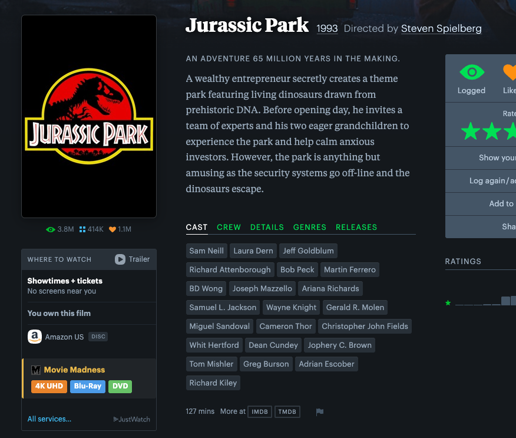

# Movie Madness Availability for Letterboxd

Long live physical media!

Movie Madness is an independent video store and nonprofit film museum in Portland, Oregon. This script adds [Movie Madness](https://www.moviemadness.org) rental availability to [Letterboxd](https://letterboxd.com) film pages. 

When you're browsing a film on Letterboxd, the script checks the Movie Madness collection and shows which formats are available to rent — with a direct link to the search results.

## Installation

1. Install a userscript manager for your browser:
   - [Tampermonkey](https://www.tampermonkey.net/) (Chrome, Firefox, Safari, Edge) — recommended
   - [Greasemonkey](https://www.greasespot.net/) (Firefox)
   - [Violentmonkey](https://violentmonkey.github.io/) (Chrome, Firefox)

2. Click this link to install the script: **[moviemadness-letterboxd.user.js](https://github.com/tjsander/mmboxmonkey/raw/main/moviemadness-letterboxd.user.js)**

   Or install manually: open your userscript manager dashboard, create a new script, and paste in the contents of `moviemadness-letterboxd.user.js`.

3. Navigate to any film page on Letterboxd (e.g. `letterboxd.com/film/hellraiser/`). The widget appears in the "Where to Watch" panel.

## How it works

On each Letterboxd film page the script:

1. Reads the film title (and year, if present) from the page's Open Graph metadata.
2. Fetches `moviemadness.org/search/?query=<title>` via `GM_xmlhttpRequest`, bypassing CORS restrictions.
3. Parses the server-rendered HTML for heading elements whose title matches the searched film, then extracts format labels (`4K UHD`, `Blu-Ray`, `DVD`, `VHS`).
4. Injects a small widget into the "Where to Watch" panel showing available formats as colored badges, each linking to the Movie Madness search results.

Title matching handles common variations between the two sites — articles moved to the end (`GODFATHER, THE`), edition suffixes (`(UNRATED)`, `(ARROW)`), and inconsistent Blu-Ray spellings (`BLU RAY` vs `BLU-RAY`).

## Notes

- Availability reflects what's in the Movie Madness collection, not whether a specific copy is currently on the shelf.
- For films with remakes or multiple releases sharing the same title, formats from all matching entries are shown. The Movie Madness site doesn't have much of an API. In the future I may look into bootstrapping off of IMDB to get better unique identifiers for individual movies.
- The script only runs on `letterboxd.com/film/*` pages and makes no requests until you visit one.

## License

MIT — see [LICENSE](LICENSE).
