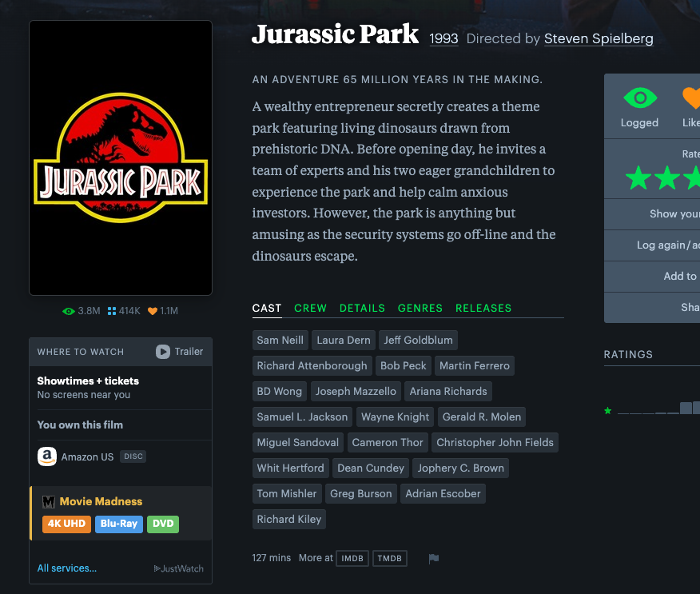

# Movie Madness Availability for Letterboxd

Long live physical media!

Movie Madness is an independent video store and nonprofit film museum in Portland, Oregon. This script adds [Movie Madness](https://www.moviemadness.org) rental availability to [Letterboxd](https://letterboxd.com) film pages. 

When you're browsing a film on Letterboxd, the script checks the Movie Madness collection and shows which formats are available to rent — with a direct link to the search results.

## Installation

1. Install a userscript manager for your browser:
   - [Tampermonkey](https://www.tampermonkey.net/) (Chrome, Firefox, Safari, Edge) — recommended
   - [Greasemonkey](https://www.greasespot.net/) (Firefox)
   - [Violentmonkey](https://violentmonkey.github.io/) (Chrome, Firefox)

2. Click this link to install the script: **[moviemadness-letterboxd.user.js](https://github.com/tjsander/mmboxmonkey/raw/main/moviemadness-letterboxd.user.js)**

   Or install manually: open your userscript manager dashboard, create a new script, and paste in the contents of `moviemadness-letterboxd.user.js`.

3. Navigate to any film page on Letterboxd (e.g. `letterboxd.com/film/hellraiser/`). The widget appears in the "Where to Watch" panel.

## How it works

On each Letterboxd film page the script:

1. Reads the film title, year, and director credits from the page's Open Graph metadata and crew links.
2. Fetches `moviemadness.org/search/?query=<title>` via `GM_xmlhttpRequest`, bypassing CORS restrictions.
3. Parses the server-rendered HTML into individual catalog entries, keeps the ones whose title, year, and director match the film you're viewing, then extracts format labels (`4K UHD`, `Blu-Ray`, `DVD`, `VHS`).
4. Injects a small widget into the "Where to Watch" panel showing available formats as colored badges, each linking to the Movie Madness search results.

Title matching handles common variations between the two sites — articles moved to the end (`GODFATHER, THE`), edition suffixes (`(UNRATED)`, `(ARROW)`), inconsistent Blu-Ray spellings (`BLU RAY` vs `BLU-RAY`), and sequel numbers Movie Madness adds ahead of a subtitle (`JAWS 4: THE REVENGE` for *Jaws: The Revenge*).

### Matching the right film

Title and year alone produce false positives: remakes, unrelated films sharing a title, and catalog entries whose year is missing from the listing. Each Movie Madness entry is therefore checked against the director credited on Letterboxd, in order of reliability:

1. **TMDB crew credits.** Most catalog entries carry crew data sourced from TMDB; the name credited as `(Director)` is compared against Letterboxd's. This is the strongest signal and covers roughly four out of five entries.
2. **Movie Madness's own `Director:` field.** Used when an entry has no TMDB crew. It sometimes credits the writer instead (`KING, STEPHEN (WRITTEN BY)`), so only unqualified credits are trusted.
3. **Exact year.** For entries with no usable director credit, the release year must match exactly rather than within the usual ±1 tolerance.

If Letterboxd doesn't expose a director for the page, verification is skipped and the previous title-and-year behavior applies.

## Notes

- Availability reflects what's in the Movie Madness collection, not whether a specific copy is currently on the shelf.
- Formats from all verified entries for a film are combined, so a title held on several discs shows every format available.
- **On unique identifiers:** Movie Madness doesn't publish one. Its pages expose only internal ids (`data-mmdb-id`, `data-wp-id`), and the public WordPress REST API (`/wp-json/wp/v2/rental/<id>`) returns no TMDB or IMDb field. The catalog *is* built on TMDB data — posters and cast portraits are hotlinked from `image.tmdb.org`, and the poster filename is a real TMDB poster path — but that path can't be used as a key: entries for the same film sometimes use different posters (the 4K and Blu-Ray editions of *Heat* use two different ones), and turning Letterboxd's TMDB id into a poster path would need a TMDB API key. Director verification gets the same accuracy without one.
- The script only runs on `letterboxd.com/film/*` pages and makes no requests until you visit one.

## License

MIT — see [LICENSE](LICENSE).
